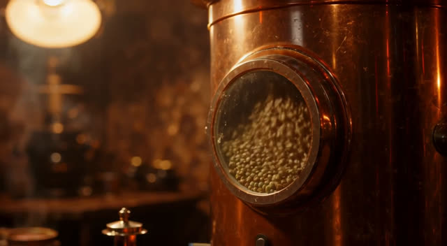
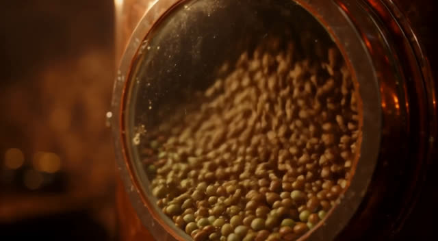

# 08 咖啡豆 AI 变体：视频模型对比（2026-10-02）

变体做法：分镜、提示词由 opus-5.5 写，开源视频模型生成画面，再由现有引擎合成字幕、价签、片尾卡、配音和配乐。
同一组提示词（`../bakeoff.json`：烘豆机 `roast`、手冲 `pourover`），1280x704、24fps、5 秒、种子 1111。

## 结论：选 LTX-2.5（蒸馏版 + FP8）

| | LTX-2.5 distilled FP8 | Wan 2.2 TI2V-5B |
|---|---|---|
| 机器 | g6e.xlarge，L40S 48GB，ap-northeast-1 | g6.2xlarge，L4 24GB，us-east-2 |
| 结果 | 2 段都生成，ffprobe 校验通过 | **0 段**：采样完成后 VAE 解码 CUDA OOM |
| 采样步数 | 8 + 4（两阶段） | 50 |
| GPU 计算 / 段 | 几十秒（去噪约 4-6 s/步，解码不到 1 秒） | 采样约 23 分钟，未能解码 |
| 实测墙钟 / 段 | 925-958 秒，几乎全是加载（见下） | 无 |
| 显存峰值 | 25.6 GB / 48 | 22 GB 用满后 OOM |
| 反向提示词 | 蒸馏版不支持 | CLI 不支持，只用内置默认 |
| 权重 | HF 受限仓库，需同意许可 + token | 公开 |
| 许可 | LTX 社区许可 | Apache 2.0 |

**LTX 墙钟时间的说明：** g6e.xlarge 只有 30GB 内存，42GB 的 transformer 要靠 64GB swap 分页读入，
每段约 15 分钟都花在读盘上；`gen.py` 每段重新加载一次模型，所以热启动也不更快。
正式出片应换 g6e.2xlarge（64GB 内存）或更大，并改成只加载一次连续生成，预计每段降到一分钟以内（未实测）。

## 画质（LTX）

| 烘豆机 首帧 | 烘豆机 第 3 帧 |
|---|---|
|  |  |

| 手冲 第 2 帧 | 手冲 第 4 帧 |
|---|---|
|  |  |

- **烘豆机：** 铜色滚筒、圆形观察窗、暖光、虚化背景、景深都对；豆子按提示从青绿变棕。缺点：豆子偏圆，有点像扁豆，密集处略糊。
- **手冲：** 晨光、蒸汽穿过光束、手冲壶、玻璃分享壶，实拍感最强。缺点：滤杯是简化的锥形而不是带螺纹的 V60，水流偏粗。
- 两段都没有变形或闪烁，明显超过代码搭建的 three.js 版本。

## 部署脚本

- LTX：`../ltx/README.md`、`../ltx/setup.sh`、`../ltx/gen.py`
- Wan：`../wan/README.md`、`../wan/setup.sh`、`../wan/gen.sh`
- 多实例与大根盘：`../../../factory/cloud.mjs`（`OPUS55_INSTANCE`、`--disk`）

视频片段和原始帧在 `../../out/ai/`，按仓库规则不入 git。
