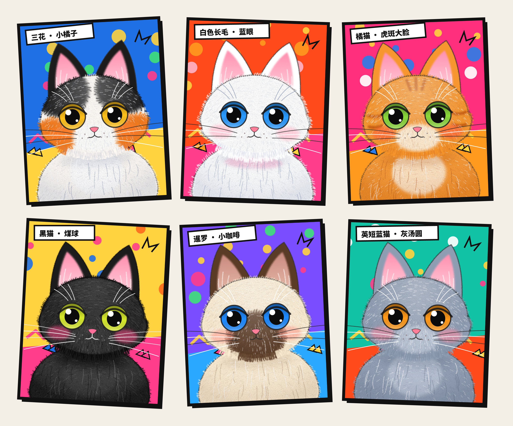

# 12 · 六只绒毛波普猫猫 —— 矢量插画复刻

参照一张宠物零食的波普风海报，用代码画出六只不同品种的猫：三花、白色长毛、橘猫虎斑、黑猫、暹罗和英短蓝猫。这个案例要验证的是，Claude Opus 5.5 能否在多轮对话里按反馈一步步调整插画的风格。

画面全部是 SVG 矢量图，由 [`cats.js`](cats.js) 里的纯函数生成，没有用位图素材，也没有调用图像生成模型。其中的随机量都来自带种子的随机数，所以同一只猫每次生成的 SVG 逐字节相同。



## 风格要点

| | |
|---|---|
| **绒毛** | 大部分是短绒毛，不是炸开的毛尖：<br>- 脸和胸口的轮廓是平滑的团子形，边缘有一圈密密的短毛，一半从里面长出来，盖住描边；<br>- 面内铺几百道顺着毛向的细笔触，深色、浅色各一层，再叠一层彩铅颗粒（`feTurbulence`）；<br>- 整组再过一遍高频位移（`feDisplacementMap`），让边缘带一点手绘的抖动；<br>- 胸口画了一绺一绺的长毛 |
| **描边** | 猫身上的描边是很多短线叠出来的细线，用半透明深灰，像马克笔草草勾的边。只有画框保留粗黑边和右下的硬投影，和原海报一样 |
| **头身过渡** | 下巴不画轮廓线，只留一道很淡的弧线。从下巴往下垂一圈领毛，每根毛的颜色取自它所在的部位，比如三花两腮是橘色，暹罗脸中是深咖色，这样头和身子之间是渐变过去的。下巴底下还有一层很淡的阴影 |
| **花色** | 三花头顶黑、两腮橘、中间留一道白；暹罗的耳朵和脸中间是深色；橘猫有虎斑纹。色块先做模糊，边缘再长出同色的绒毛，看起来是一丝一丝晕开的 |
| **五官** | 大圆眼睛：瞳孔大，上眼皮画重一些，上暗下亮，带两个高光点。粉色小鼻子，「人」字形的嘴，白色的眉毛须和长胡须，腮红是模糊的 |

## 文件

| 文件 | 说明 |
|---|---|
| `cats.js` | 六只猫的数据（配色、花色、眼睛颜色、角度）和 `catSVG(cat, i)` 生成器，浏览器和 Node 都能用 |
| `index.html` | 预览页：3 × 2 歪着贴的拼贴，跟海报一样 |
| `export.mjs` | 导出脚本：写出 `assets/svg/*.svg` 和 `assets/poster.svg`，再用 [resvg](https://github.com/yisibl/resvg-js) 渲染成 3 倍图的 PNG |
| `assets/svg/` | 六只猫各一张 SVG（306 × 386） |
| `assets/png/` | 对应的 PNG（918 × 1158，透明边） |
| `assets/poster.svg` / `poster.png` | 拼贴海报（PNG 是 3198 × 2658） |

## 运行

在 `opus-5.5/` 下运行：

```bash
npm install                      # 装 @resvg/resvg-js
node 12-pop-cats/export.mjs      # 默认 3 倍图；--scale 2 可改倍数
npm run serve                    # 然后打开 http://127.0.0.1:8765/12-pop-cats/
```

导出时不用浏览器：resvg 支持这里用到的 `feTurbulence`、`feDisplacementMap` 和 `feGaussianBlur` 滤镜。标签用的是 Noto Sans CJK SC Black 字体，第一次导出时会下载到 `opus-5.5/.scratch/fonts/`，这个目录已经在 `.gitignore` 里。

> 原海报是彩铅手绘，一层层叠出来的软毛和纸纹，矢量图只能接近，做不到一模一样。
